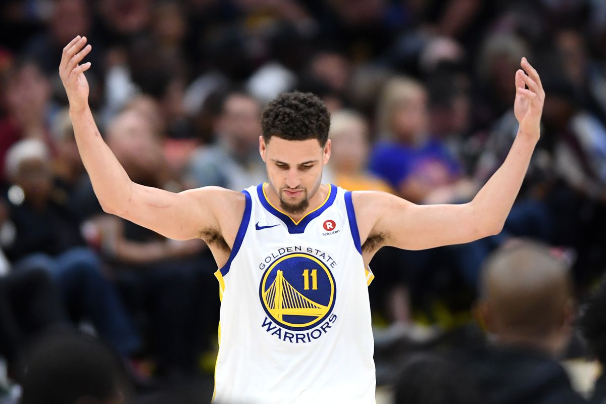
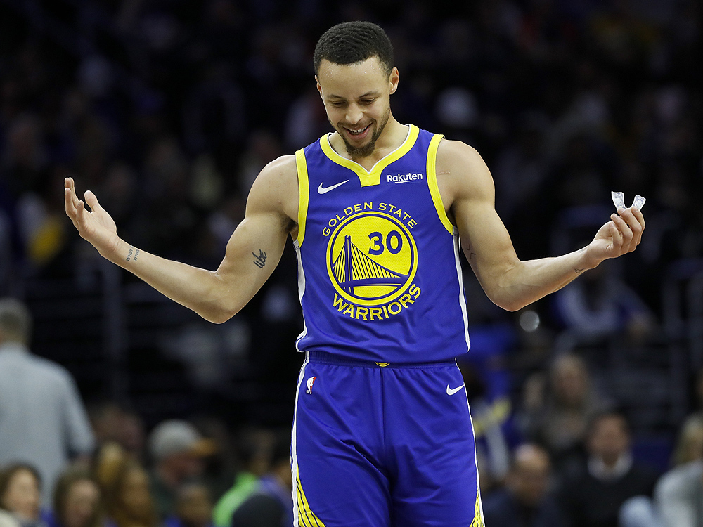
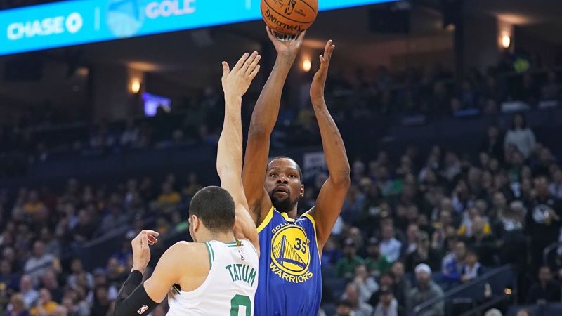
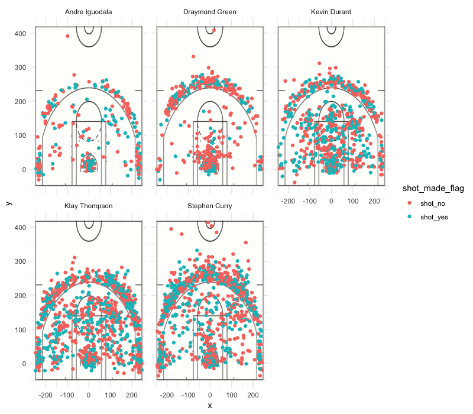

Workout01-Jason-Zhao
================
Jason Zhao
3/9/2019

Report of Golden State Warrior Performance
==========================================

Introduction:
-------------

The purpose of this article is to find out and compare the performances of five Golden State Warriors players: Andre Iguodala, Draymond Green, Kevin Durant, Klay Thompson, and Stephen Curry. There are three tables comparing the two-pointer, three-pointer, and the total points made and made percentages of the five players. The chart at the end also indicates the position of the court in which the players made the shot.

Background & Analysis
---------------------

The following contains the code to create the chart for 2PT field Goal analysis.

``` r
library(readr)
dat = read_csv('/Users/jasonzhao/Desktop/Stats 133/HW/Workout01/data/shots-data.csv')
```

    ## Warning: Missing column names filled in: 'X1' [1]

    ## Parsed with column specification:
    ## cols(
    ##   X1 = col_integer(),
    ##   team_name = col_character(),
    ##   game_date = col_character(),
    ##   season = col_integer(),
    ##   period = col_integer(),
    ##   minutes_remaining = col_integer(),
    ##   seconds_remaining = col_integer(),
    ##   shot_made_flag = col_character(),
    ##   action_type = col_character(),
    ##   shot_type = col_character(),
    ##   shot_distance = col_integer(),
    ##   opponent = col_character(),
    ##   x = col_integer(),
    ##   y = col_integer(),
    ##   name = col_character(),
    ##   minute = col_integer()
    ## )

``` r
andre <- dat$shot_type[] == "2PT Field Goal" & dat$name[] == "Andre Iguodala"
draymond <- dat$shot_type[] == "2PT Field Goal"& dat$name[] == "Draymond Green"
kevin<-dat$shot_type[] == "2PT Field Goal"& dat$name[] == "Kevin Durant"
klay<-dat$shot_type[] == "2PT Field Goal"& dat$name[] == "Klay Thompson"
stephen<-dat$shot_type[] == "2PT Field Goal"& dat$name[] ==  "Stephen Curry"

andre2 <- dat$shot_type[] == "2PT Field Goal" & dat$name[] == "Andre Iguodala" & dat$shot_made_flag[] == "shot_yes"
draymond2 <- dat$shot_type[] == "2PT Field Goal"& dat$name[] == "Draymond Green"& dat$shot_made_flag[] == "shot_yes"
kevin2<-dat$shot_type[] == "2PT Field Goal"& dat$name[] == "Kevin Durant"& dat$shot_made_flag[] == "shot_yes"
klay2<-dat$shot_type[] == "2PT Field Goal"& dat$name[] == "Klay Thompson"& dat$shot_made_flag[] == "shot_yes"
stephen2<-dat$shot_type[] == "2PT Field Goal"& dat$name[] ==  "Stephen Curry"& dat$shot_made_flag[] == "shot_yes"
```

``` r
name<- c("Andre Iguodala","Draymond Green","Kevin Durant","Klay Thompson","Stephen Curry")
total<- c(sum(andre),sum(draymond),sum(kevin),sum(klay),sum(stephen))
made<- c(sum(andre2),sum(draymond2),sum(kevin2),sum(klay2),sum(stephen2))
two_pt_effective<- data.frame(
  name,
  total,
  made,
  perc_made = made/total
)
```

The following is the two pt field goal Analysis:

``` r
two_pt_effective
```

    ##             name total made perc_made
    ## 1 Andre Iguodala   210  134 0.6380952
    ## 2 Draymond Green   346  171 0.4942197
    ## 3   Kevin Durant   643  390 0.6065319
    ## 4  Klay Thompson   640  329 0.5140625
    ## 5  Stephen Curry   563  304 0.5399645

As shown from the two pointer table, it is clear that Andre Iguodala is the most effective two pointer of the five as his percentage made is 63.8%, highest amongst all of them. While Kevin durant made the most amount of two pointers with 643 shots made.

 (The celebration Klay Thompson did after he made a shot)

The following contains the code to create the chart for 3PT field Goal analysis.

``` r
andre3 <- dat$shot_type[] == "3PT Field Goal" & dat$name[] == "Andre Iguodala"
draymond3<- dat$shot_type[] == "3PT Field Goal"& dat$name[] == "Draymond Green"
kevin3<-dat$shot_type[] == "3PT Field Goal"& dat$name[] == "Kevin Durant"
klay3<-dat$shot_type[] == "3PT Field Goal"& dat$name[] == "Klay Thompson"
stephen3<-dat$shot_type[] == "3PT Field Goal"& dat$name[] ==  "Stephen Curry"

andre4 <- dat$shot_type[] == "3PT Field Goal" & dat$name[] == "Andre Iguodala" & dat$shot_made_flag[] == "shot_yes"
draymond4 <- dat$shot_type[] == "3PT Field Goal"& dat$name[] == "Draymond Green"& dat$shot_made_flag[] == "shot_yes"
kevin4<-dat$shot_type[] == "3PT Field Goal"& dat$name[] == "Kevin Durant"& dat$shot_made_flag[] == "shot_yes"
klay4<-dat$shot_type[] == "3PT Field Goal"& dat$name[] == "Klay Thompson"& dat$shot_made_flag[] == "shot_yes"
stephen4<-dat$shot_type[] == "3PT Field Goal"& dat$name[] ==  "Stephen Curry" & dat$shot_made_flag[] == "shot_yes"
```

``` r
name<- c("Andre Iguodala","Draymond Green","Kevin Durant","Klay Thompson","Stephen Curry")
total<- c(sum(andre3),sum(draymond3),sum(kevin3),sum(klay3),sum(stephen3))
made<- c(sum(andre4),sum(draymond4),sum(kevin4),sum(klay4),sum(stephen4))
three_pt_effective<- data.frame(
  name,
  total,
  made,
  perc_made = made/total
)
```

The following is the Three point Fiel Goal Analysis.

``` r
three_pt_effective
```

    ##             name total made perc_made
    ## 1 Andre Iguodala   161   58 0.3602484
    ## 2 Draymond Green   232   74 0.3189655
    ## 3   Kevin Durant   272  105 0.3860294
    ## 4  Klay Thompson   580  246 0.4241379
    ## 5  Stephen Curry   687  280 0.4075691

As shown from the two pointer table, it is clear that Klay Thompson is the most effective three pointer of the five as his percentage made is 42.41%, highest amongst all of them. While Stephen Curry made the most amount of two pointers with 687 shots made.

 (Stephen Curry in action)

The following is the background code for overall shot performance table

``` r
andre5 <- dat$name[] == "Andre Iguodala"
draymond5<-dat$name[] == "Draymond Green"
kevin5<-dat$name[] == "Kevin Durant"
klay5<-dat$name[] == "Klay Thompson"
stephen5<-dat$name[] ==  "Stephen Curry"

andre6 <- dat$name[] == "Andre Iguodala" & dat$shot_made_flag[] == "shot_yes"
draymond6 <- dat$name[] == "Draymond Green"& dat$shot_made_flag[] == "shot_yes"
kevin6<-dat$name[] == "Kevin Durant"& dat$shot_made_flag[] == "shot_yes"
klay6<-dat$name[] == "Klay Thompson"& dat$shot_made_flag[] == "shot_yes"
stephen6<-dat$name[] ==  "Stephen Curry" & dat$shot_made_flag[] == "shot_yes"
```

``` r
name<- c("Andre Iguodala","Draymond Green","Kevin Durant","Klay Thompson","Stephen Curry")
total<- c(sum(andre5),sum(draymond5),sum(kevin5),sum(klay5),sum(stephen5))
made<- c(sum(andre6),sum(draymond6),sum(kevin6),sum(klay6),sum(stephen6))
total_pt_effective<- data.frame(
  name,
  total,
  made,
  perc_made = made/total
)
```

The following is the analysis for the overall performance

``` r
total_pt_effective
```

    ##             name total made perc_made
    ## 1 Andre Iguodala   371  192 0.5175202
    ## 2 Draymond Green   578  245 0.4238754
    ## 3   Kevin Durant   915  495 0.5409836
    ## 4  Klay Thompson  1220  575 0.4713115
    ## 5  Stephen Curry  1250  584 0.4672000

As shown from the two pointer table, it is clear that Kevin Durant is the most effective overall performer of the five as his percentage made of all shots is 54.09%, highest amongst all of them. While Stephen Curry made the most amount of two pointers with 643 shots made.

 (kevin durant in his best shape)

Finally, this is the graph of the amount of shots of each player made in various locations of the court. 

From the graph, this is evident that Stephen Curry and Kevin Durant made most shots from the three points line, and the data table concur with the demonstration of the graph statistics. It is beyond the shadow of the doubt that these five players are ranked the best players in Golden State Warrior, if not the entire NBA league. However, within those five, it is clear that Kevin Durant with the relatively high amount of shots made with the highest effectiveness, he is the bread winner of the five players. On the other hand, Stephen Curry also takes home one of the highest amount of three pointers, confirming his legend as a three pointer god.
